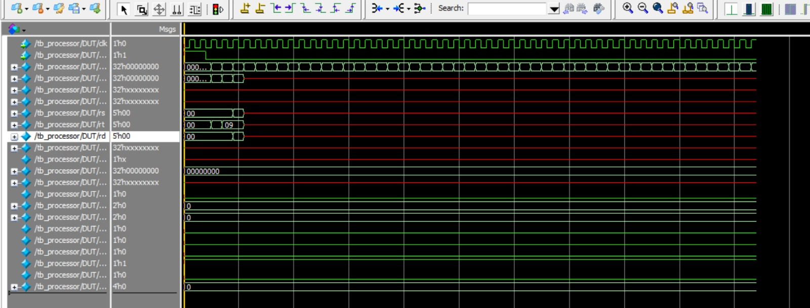

# Implementación de un Procesador Pipeline de 5 Etapas en Verilog

---

## 💻 Simulación de Ondas

Comprobación del funcionamiento del hardware segmentado y la validación de las etapas de ejecución a través de ModelSim:



---

## 📄 Código Fuente (Verilog)

A continuación se detalla la implementación en Verilog de cada uno de los módulos que componen la arquitectura del procesador.

### Hazard Unit (Control de Riesgos)
```verilog
module HazardUnit (
    input rs_used, rt_used,
    input [4:0] rs_addr, rt_addr,
    input [4:0] ex_rd, mem_rd,
    input ex_reg_write, mem_reg_write,
    input ex_mem_read,
    output reg [1:0] forward_a, forward_b,
    output reg stall
);
    // Lógica combinacional simple para forwarding y stalls
    always @(*) begin
        // Forwarding por defecto
        forward_a = 2'b00;
        forward_b = 2'b00;
        stall = 1'b0;

        // Data Hazard Forwarding desde MEM
        if (mem_reg_write && (mem_rd != 0)) begin
            if (rs_used && (mem_rd == rs_addr)) forward_a = 2'b10;
            if (rt_used && (mem_rd == rt_addr)) forward_b = 2'b10;
        end

        // Data Hazard Forwarding desde EX
        if (ex_reg_write && (ex_rd != 0)) begin
            if (rs_used && (ex_rd == rs_addr)) forward_a = 2'b01;
            if (rt_used && (ex_rd == rt_addr)) forward_b = 2'b01;
        end

        // Load Use Hazard Necesitamos detener el pipeline un ciclo
        if (ex_mem_read && ((ex_rd == rs_addr) || (ex_rd == rt_addr))) begin
            stall = 1'b1;
        end
    end
endmodule
```

### Instruction Fetch (IF)
```verilog
module IF_stage (
    input clk, reset, stall,
    input [31:0] branch_target,
    input take_branch,
    output reg [31:0] pc,
    output [31:0] instruction
);
    // Memoria de instrucciones
    reg [31:0] inst_mem [0:255]; 

    // Inicializar con algunas instrucciones dummy para simulación
    initial begin
        $readmemh("instructions.hex", inst_mem); 
    end

    // Actualización del Program Counter
    always @(posedge clk or posedge reset) begin
        if (reset) begin
            pc <= 32'b0;
        end else if (!stall) begin
            if (take_branch) pc <= branch_target;
            else pc <= pc + 4; // Avanza a la siguiente instrucción
        end
    end

    // Lectura asíncrona de la memoria
    assign instruction = inst_mem[pc[9:2]]; 
endmodule
```

### Instruction Decode (ID)
```verilog
module ID_stage (
    input clk, reset,
    input [31:0] instruction,
    input [4:0] wb_rd,
    input [31:0] wb_data,
    input wb_reg_write,
    output [31:0] reg_data1, reg_data2,
    output [4:0] rs, rt, rd
);
    // Banco de registros
    reg [31:0] registers;

    assign rs = instruction[25:21];
    assign rt = instruction[20:16];
    assign rd = instruction[15:11];

    // Lectura de registros
    assign reg_data1 = registers[rs];
    assign reg_data2 = registers[rt];

    // Escritura en la etapa WB (se hace en el flanco negativo o manejado por control)
    always @(posedge clk) begin
        if (wb_reg_write && wb_rd != 0) begin
            registers[wb_rd] <= wb_data;
        end
    end
endmodule
```

### Memory Access (MEM)
```verilog
module MEM_stage (
    input clk,
    input mem_read, mem_write,
    input [31:0] address, write_data,
    output [31:0] read_data
);
    // Memoria de datos RAM
    reg [31:0] data_mem [0:255];

    assign read_data = (mem_read) ? data_mem[address[9:2]] : 32'b0;

    always @(posedge clk) begin
        if (mem_write) begin
            data_mem[address[9:2]] <= write_data;
        end
    end
endmodule
```

### Write Back (WB)
```verilog
module WB_stage (
    input [31:0] alu_result,  
    input [31:0] read_data,   
    input mem_to_reg,        
    output [31:0] wb_data     
);

    assign wb_data = (mem_to_reg) ? read_data : alu_result;

endmodule
```

### Pipeline Processor
```verilog
module pipeline(
    input clk,
    input reset
);

    // Cables intermedios
    wire [31:0] pc_out;
    wire [31:0] instruction;
    wire [31:0] reg_data1, reg_data2;
    wire [4:0] rs, rt, rd;
    wire [31:0] alu_result;
    wire zero_flag;
    wire [31:0] read_data;
    wire [31:0] wb_data;
    wire stall;
    wire [1:0] forward_a, forward_b;
    
    // Señales de control dummy
    wire take_branch = 1'b0;
    wire mem_read = 1'b0;
    wire mem_write = 1'b0;
    wire wb_reg_write = 1'b1;
    wire mem_to_reg = 1'b0;
    wire [3:0] alu_control = 4'b0000;

    //INSTANCIAS

    HazardUnit hazard_unit_inst (
        .rs_used(1'b1), .rt_used(1'b1), 
        .rs_addr(rs), .rt_addr(rt),
        .ex_rd(rd), .mem_rd(rd),
        .ex_reg_write(1'b1), .mem_reg_write(1'b1),
        .ex_mem_read(mem_read),
        .forward_a(forward_a), .forward_b(forward_b),
        .stall(stall)
    );

    IF_stage if_inst (
        .clk(clk), 
        .reset(reset), 
        .stall(stall),
        .branch_target(32'b0), 
        .take_branch(take_branch),
        .pc(pc_out),
        .instruction(instruction)
    );

    ID_stage id_inst (
        .clk(clk), 
        .reset(reset),
        .instruction(instruction),
        .wb_rd(rd),          
        .wb_data(wb_data),   
        .wb_reg_write(wb_reg_write),
        .reg_data1(reg_data1), 
        .reg_data2(reg_data2),
        .rs(rs), .rt(rt), .rd(rd)
    );

    EX_stage ex_inst (
        .alu_in1(reg_data1), 
        .alu_in2(reg_data2),
        .alu_control(alu_control),
        .alu_result(alu_result),
        .zero(zero_flag)
    );

    MEM_stage mem_inst (
        .clk(clk),
        .mem_read(mem_read), 
        .mem_write(mem_write),
        .address(alu_result), 
        .write_data(reg_data2),
        .read_data(read_data)
    );

    WB_stage wb_inst (
        .alu_result(alu_result),
        .read_data(read_data),
        .mem_to_reg(mem_to_reg),
        .wb_data(wb_data)
    );

endmodule
```

### Testbench
```verilog
module tb_processor();

    reg clk;
    reg reset;

    // Instanciación del Diseño Bajo Prueba
    // Se conecta el Top Level del pipeline a nuestras señales locales
    pipeline DUT (
        .clk(clk),
        .reset(reset)
    );

    // Generación del Reloj
    // Se invierte el valor de "clk" cada 5 ns, logrando un periodo de 10 ns (100 MHz)
    always #5 clk = ~clk; 

    // 4. Bloque principal de estímulos
    initial begin
        // Inicialización de señales
        clk = 0;
        reset = 1; // Mantenemos el reset activo para limpiar los registros del pipeline

        // Esperamos 20 ns
        #20; 
        
        // Liberamos el reset para que el procesador comience la etapa de Fetch
        reset = 0; 

        // Definimos el tiempo de simulación. 80 ns es suficiente para ver las 
        // instrucciones de nuestro archivo instructions.hex pasar por las 5 etapas.
        #80; 
        
        $stop; 
    end

    // Monitoreo de señales en consola
    // Imprime en tiempo real los valores de los cables principales para auditoría
    initial begin
        $monitor("Tiempo: %40t ns | PC: %h | Inst: %h | ALU_Res: %h", 
                 $time, DUT.pc_out, DUT.instruction, DUT.alu_result);
    end

endmodule
```
